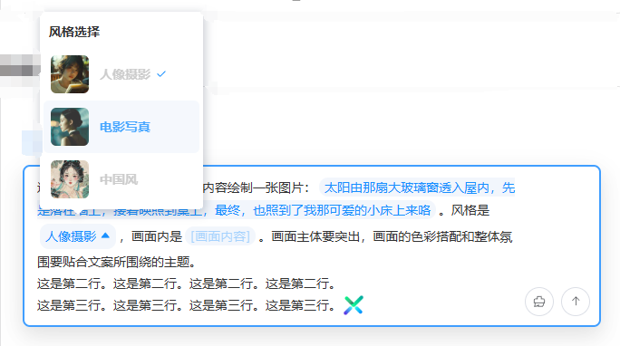

## Introduction

**`EditorSender`** is here! 🙊 Designed specifically for **multimodal models** and **custom prompt scenarios**, this input box component solves core development needs such as **tag insertion, content mentions, and custom prompt input**, better showcasing the power of multimodal functionality.

::: warning
There are certain development differences between the `EditorSender` component and the `Sender` component. Please choose according to your actual needs.

:::

## Code Demonstrations

### Basic Usage

<demo src="./demos/basic.vue"></demo>

### Placeholder Text

<demo src="./demos/placeholder.vue"></demo>

### Auto Focus

<demo src="./demos/autoFocus.vue"></demo>

### State Properties

<demo src="./demos/state.vue"></demo>

### Variant - Vertical Style

<demo src="./demos/variant.vue"></demo>

### Custom Action List

<demo src="./demos/action-list.vue"></demo>

### Custom Prefix

<demo src="./demos/prefix.vue"></demo>

### Custom Header

<demo src="./demos/header.vue"></demo>

### Custom Footer

<demo src="./demos/footer.vue"></demo>

### Custom Input Box Style

<demo src="./demos/custom-style.vue"></demo>

### Maximum Input Length

<demo src="./demos/max-length.vue"></demo>

### Submission Methods

<demo src="./demos/submit-type.vue"></demo>

### Paste Files

<demo src="./demos/pasteFile.vue"></demo>

## Advanced Usage

### Insert Text Content

<demo src="./demos/insert-text.vue"></demo>

### Insert HTML Content

<demo src="./demos/insert-html.vue"></demo>

### Insert Select Tag

<demo src="./demos/insert-select-tag.vue"></demo>

### Insert Input Tag

<demo src="./demos/insert-input-tag.vue"></demo>

### Insert User Tag

<demo src="./demos/insert-user-tag.vue"></demo>

### Insert Custom Tag

<demo src="./demos/insert-custom-tag.vue"></demo>

### Mixed Tag Override Writing

<demo src="./demos/mix-tag.vue"></demo>

### Prefix Prompt Tag

<demo src="./demos/prefix-tag.vue"></demo>

### Asynchronous Loading of @Members

<demo src="./demos/async-user-tag.vue"></demo>

### Custom Mention Popup

<demo src="./demos/custom-mention.vue"></demo>

### Device Type (PC/H5)

<demo src="./demos/device.vue"></demo>

## Properties

| Property Name          | Type                                       | Required | Default Value          | Description                                                                                                                                   |
| ---------------------- | ------------------------------------------ | -------- | ---------------------- | --------------------------------------------------------------------------------------------------------------------------------------------- |
| `placeholder`          | String                                     | No       | 'Please enter content' | Input box placeholder text                                                                                                                    |
| `device`               | 'pc' \| 'h5'                               | No       | 'pc'                   | Device type using the editor. PC has built-in rich popup selection features; H5 requires custom popup implementation                          |
| `autoFocus`            | Boolean                                    | No       | false                  | Whether to automatically focus on the input box after component mounting                                                                      |
| `variant`              | 'default' \| 'updown'                      | No       | 'default'              | Input box variant type. 'default' is horizontal layout; 'updown' is vertical layout                                                           |
| `userList`             | UserInfo[]                                 | No       | []                     | User list for @mention functionality                                                                                                          |
| `customTrigger`        | CustomTag[]                                | No       | []                     | Extended custom popup trigger configuration list                                                                                              |
| `selectList`           | SelectTag[]                                | No       | []                     | Configuration list for tag dropdown selection options                                                                                         |
| `maxLength`            | Number                                     | No       | undefined              | Limit the maximum number of characters in the input box. High performance cost, not recommended unless necessary                              |
| `submitType`           | 'enter' \| 'shiftEnter'                    | No       | 'enter'                | Control line break and submission mode: 'enter' for Enter submit/Shift+Enter line break; 'shiftEnter' for Shift+Enter submit/Enter line break |
| `customStyle`          | Record<string, any>                        | No       | {}                     | Used to modify the style of the input box                                                                                                     |
| `loading`              | Boolean                                    | No       | false                  | Loading state of the send button. Shows loading animation when true                                                                           |
| `disabled`             | Boolean                                    | No       | false                  | Whether to disable the input box. Disabled boxes cannot be entered or operated                                                                |
| `clearable`            | Boolean                                    | No       | false                  | Whether to show the clear button                                                                                                              |
| `headerAnimationTimer` | Number                                     | No       | 300                    | Duration of header expansion/collapse animation, in ms                                                                                        |
| `asyncMatchFun`        | (searchVal: string) => Promise<UserInfo[]> | No       | undefined              | Method for asynchronously loading group members, used for remote search in @mention functionality                                             |
| `customDialog`         | Boolean                                    | No       | false                  | Whether to enable custom popup. When enabled, internal popups will not be created; popup logic must be implemented manually                   |

## Events

| Event Name         | Description                             | Callback Parameters                                                |
| ------------------ | --------------------------------------- | ------------------------------------------------------------------ |
| `submit`           | Triggered when submitting content       | `payload: SubmitResult` - Contains various submitted content       |
| `change`           | Triggered when input content changes    | None                                                               |
| `cancel`           | Triggered when canceling loading state  | None                                                               |
| `showAtDialog`     | Triggered when showing @user popup      | None                                                               |
| `showSelectDialog` | Triggered when showing select tag popup | `key: string` - Tag key name, `elm: HTMLElement` - Trigger element |
| `showTagDialog`    | Triggered when showing custom tag popup | `prefix: string` - Tag prefix                                      |
| `pasteFile`       | Triggered when paste files                                    | `interface PasteFileEvent{firstFile: File; fileList: FileList}`                 |

## Ref Instance Methods

| Method Name        | Type                                                              | Description                                                                                  |
| ------------------ | ----------------------------------------------------------------- | -------------------------------------------------------------------------------------------- |
| `getCurrentValue`  | () => SubmitResult                                                | Get the current content of the input box, including text, HTML, and various tag information  |
| `focusToStart`     | () => void                                                        | Focus the cursor to the beginning of the text                                                |
| `focusToEnd`       | () => void                                                        | Focus the cursor to the end of the text                                                      |
| `blur`             | () => void                                                        | Remove focus from the input box                                                              |
| `selectAll`        | () => void                                                        | Select all content in the input box                                                          |
| `clear`            | (txt?: string) => void                                            | Clear the input box content. Optional parameter txt is the text to insert after clearing     |
| `setSelectTag`     | (key: string, tagId: string) => void                              | Insert a select tag                                                                          |
| `setInputTag`      | (key: string, placeholder: string, defaultValue?: string) => void | Insert an input tag                                                                          |
| `setUserTag`       | (userId: string) => void                                          | Insert a @mention tag                                                                        |
| `setCustomTag`     | (prefix: string, id: string) => void                              | Insert a custom trigger tag                                                                  |
| `setMixTags`       | (tags: MixTag[][]) => void                                        | Insert multiple tags in a mixed manner                                                       |
| `setHtml`          | (html: string) => void                                            | Insert HTML snippet at current cursor position (inline or inline-block elements recommended) |
| `setText`          | (txt: string) => void                                             | Insert text at current cursor position                                                       |
| `openSelectDialog` | (option: SelectDialogOption) => void                              | Externally call to open tag selection popup                                                  |
| `customSetUser`    | (user: UserInfo) => void                                          | Write @mention tag in custom popup (private API, automatically truncates trigger)            |
| `customSetTag`     | (prefix: string, tag: TagInfo) => void                            | Write custom trigger tag in custom popup (private API, automatically truncates trigger)      |
| `updateSelectTag`  | (elm: HTMLElement, tag: TagInfo) => void                          | Update select tag content                                                                    |
| `openTipTag`       | (options: TipOptions) => void                                     | Open prefix prompt tag                                                                       |
| `closeTipTag`      | () => void                                                        | Close prefix prompt tag                                                                      |
| `chat`             | ChatArea instance                                                 | Exposed chat instance object                                                                 |
| `opNode`           | ChatOperateNode instance                                          | Exposed ChatNode operation object                                                            |
| `chatState`        | ChatState object                                                  | Exposed component state object                                                               |

## Slots

| Slot Name      | Parameters | Description                                        |
| -------------- | ---------- | -------------------------------------------------- |
| `#header`      | -          | Used for customizing input box header content      |
| `#prefix`      | -          | Used for customizing input box prefix content      |
| `#action-list` | -          | Used for customizing input box action list content |
| `#footer`      | -          | Used for customizing input box footer content      |

## Features

1. **Full-type Tag Engine**: Seamlessly supports multiple tag types such as @users, select tags, and custom tags. Tag insertion/update/management is a breeze, meeting complex content tagging needs.

2. **Cross-device Adaptive Interaction**: PC has a built-in popup system, while H5 supports custom popups. Automatically adapts to different device operation habits, balancing native experience with customization freedom.
